# SharePoint Fundamentals: Document Libraries and Lists

Master SharePoint document management with custom metadata fields and create powerful lists from Excel data with filters, views, and more.

---

## 🧭 Lab Details

| Level   | Persona                       | Duration   | Purpose                                                                                                                                                                                                                                                                                              |
| ------- | ----------------------------- | ---------- | ---------------------------------------------------------------------------------------------------------------------------------------------------------------------------------------------------------------------------------------------------------------------------------------------------- |
| 100 | Beginner | 45 minutes | After completing this lab, attendees will be able to create and configure SharePoint document libraries with custom metadata columns (required and optional), import Excel data into SharePoint lists, and create filters and custom views to organize and analyze information effectively. |

---

## 📚 Table of Contents

- [Why This Matters](#-why-this-matters)
- [Introduction](#-introduction)
- [Documentation and Additional Training Links](#-documentation-and-additional-training-links)
- [Prerequisites](#-prerequisites)
- [Summary of Targets](#-summary-of-targets)
- [Use Cases Covered](#-use-cases-covered)
- [Instructions by Use Case](#️-instructions-by-use-case)
  - [Use Case #1: Creating a Document Library with Custom Metadata](#-use-case-1-creating-a-document-library-with-custom-metadata)
  - [Use Case #2: Creating SharePoint Lists from Excel Data](#-use-case-2-creating-sharepoint-lists-from-excel-data)
- [Summary of Learnings](#-summary-of-learnings)
- [Conclusions & Recommendations](#conclusions--recommendations)

---

## 🤔 Why This Matters

**For Army logistics professionals and administrative staff:** Effective document and data management is critical for mission readiness. SharePoint provides powerful tools to organize, track, and find information quickly.

Think of SharePoint like a well-organized supply room:

- **Without proper organization**: Documents get lost, information is duplicated, and finding what you need takes forever
- **With structured metadata and lists**: Information is tagged, searchable, and filtered—anyone can find what they need in seconds

**Common challenges solved by this lab:**

- "I can never find the latest version of our training compliance reports"
- "We track equipment readiness in Excel but can't easily share or filter the data"
- "Different teams save documents with inconsistent naming conventions"
- "I need to quickly see all documents related to a specific division or equipment type"

**This 45-minute investment will teach you foundational SharePoint skills** that apply to any document management or data tracking scenario.

---

## 🌐 Introduction

You'll start by creating a SharePoint document library configured with custom metadata columns to organize training and certification documents. Then you'll import equipment readiness data from Excel into a SharePoint list and learn to create filters and custom views for analysis.

**Real-world example:** The AMC Logistics Center at Redstone Arsenal manages thousands of training records, certification documents, and equipment readiness reports. By implementing custom metadata in document libraries, supervisors can instantly filter to see all CUI training documents by division. Equipment readiness trends imported as SharePoint lists allow leadership to quickly identify which vehicle platforms are below operational targets—without opening a single Excel file.

---

## 📄 Documentation and Additional Training Links

- [Introduction to SharePoint Document Libraries](https://support.microsoft.com/en-us/office/introduction-to-libraries-7d4221d9-8fb9-40d5-8441-2374c84b5e26)
- [Create a Column in a List or Library](https://support.microsoft.com/en-us/office/create-a-column-in-a-list-or-library-2b0361ae-1bd3-41a3-8329-269e5f81cfa2)
- [Create a List Based on a Spreadsheet](https://support.microsoft.com/en-us/office/create-a-list-based-on-a-spreadsheet-380cfeb5-6e14-438e-988a-c2b9bea574fa)
- [Create, Change, or Delete a View of a List or Library](https://support.microsoft.com/en-us/office/create-change-or-delete-a-view-of-a-list-or-library-27ae65b8-bc5b-4949-b29b-4ee87144a9c9)

---

## ✅ Prerequisites

- Access to a SharePoint site where you have permission to create libraries and lists
- The sample files provided for this lab:
  - **05_Training_Certification_Status.md.docx** (Training compliance report)
  - **equipment_readiness_trends.xlsx** (Equipment operational readiness data)
- Basic familiarity with Microsoft 365 and web browsers

---

## 🎯 Summary of Targets

In this lab, you'll build foundational SharePoint skills. By the end of the lab, you will:

- **Create** a document library with a meaningful name and description
- **Add** custom metadata columns including text, choice, date, and number types
- **Configure** required vs. optional metadata fields
- **Upload** documents and apply metadata tags
- **Import** Excel data into a SharePoint list
- **Create** filters to narrow down list data
- **Build** custom views to display specific columns and filtered data
- **Apply** sorting and grouping to organize information

---

## 🧩 Use Cases Covered

| Step | Use Case                                                                                                                        | Value Added                                                                                                                    | Effort |
| ---- | ------------------------------------------------------------------------------------------------------------------------------- | ------------------------------------------------------------------------------------------------------------------------------ | ------ |
| 1    | [Creating a Document Library with Custom Metadata](#-use-case-1-creating-a-document-library-with-custom-metadata)                                     | Learn to organize documents with searchable, filterable metadata fields that enforce data quality                                 | 20 min |
| 2    | [Creating SharePoint Lists from Excel Data](#-use-case-2-creating-sharepoint-lists-from-excel-data) | Transform Excel spreadsheets into collaborative, filterable SharePoint lists with custom views | 25 min |

---

## 🛠️ Instructions by Use Case

---

## 📁 Use Case #1: Creating a Document Library with Custom Metadata

Learn to create a document library configured with custom columns to organize training and certification documents effectively.

| Use Case                              | Value Added                                                                                    | Estimated Effort |
| ------------------------------------- | ---------------------------------------------------------------------------------------------- | ---------------- |
| Creating a Document Library with Custom Metadata | Learn to organize documents with searchable, filterable metadata fields that enforce data quality | 20 minutes       |

**Summary of tasks**

In this section, you'll create a new document library, add custom metadata columns (both required and optional), and upload a training document with proper tagging. You'll learn the difference between column types and when to make fields required.

**Scenario:** Your organization needs a central location to store training and certification documents. Documents must be tagged with information like Document Type, Division, Fiscal Year, and Status so that supervisors can quickly find relevant records. Some fields (like Document Type) should be required to ensure consistency.

### Objective

Create a SharePoint document library with custom metadata columns that support filtering, searching, and organizational standards.

---

### Step-by-step instructions

#### Navigate to Your SharePoint Site
#### Navigate to SharePoint

1. Make sure the **Navigation pane** is open and click on **Apps**

    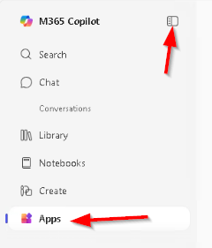
    
1. Select **SharePoint**
    
    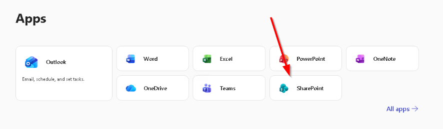

2. From the SharePoint home page, click on your team site (or the site where you want to create the library)

    

> [!TIP]
> If you don't have a SharePoint site yet, refer to the previous lab on creating a SharePoint Team Site, or ask your SharePoint administrator to create one for you.

#### Create a New Document Library

3. Once on your site, click **+ New** in the command bar at the top of the page. From the dropdown menu, select **Document library**

    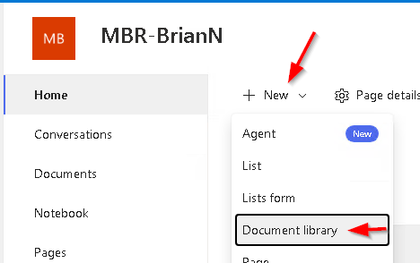

5. In the **Create a document library** panel that appears and Click **Create**:
   - **Name:** Enter `Training and Certification Documents`
   - **Description:** Enter `Central repository for workforce training records, certification documents, and compliance reports for AMC Logistics Center`

    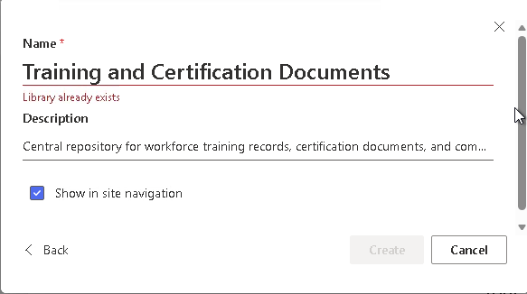

7. Your new document library will open. Notice it currently has only the default columns (Name, Modified, Modified By)

    

#### Add Custom Metadata Columns

Now you'll add custom columns to capture important metadata about each document.

##### Add a Required "Document Type" Choice Column

8. Click **+ Add column** in the column header area (or click the **+** icon next to the existing columns)

    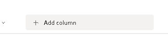

9. From the column type menu, select **Choice** and click **Next**

    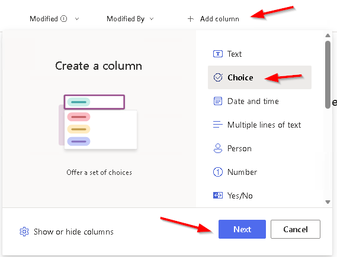

10. In the **Create a column** panel:
    - **Name:** Enter `Document Type`
    - **Description:** Enter `The category of training or certification document`

    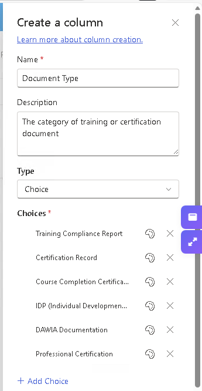

11. Under **Choices**, enter the following options (one per line):
    - `Training Compliance Report`
    - `Certification Record`
    - `Course Completion Certificate`
    - `IDP (Individual Development Plan)`
    - `DAWIA Documentation`
    - `Professional Certification`

12. Scroll down to find the **More options** section. Click to expand it

    

13. Toggle **Require that this column contains information** to **Yes**. Click **Save**

    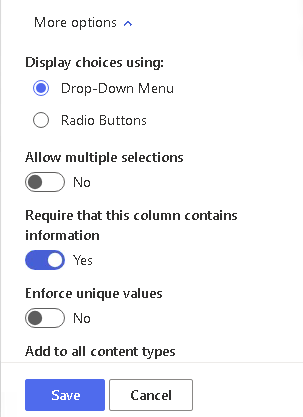

> [!IMPORTANT]
> Making a field **required** means users cannot save a document without filling in this field. Use required fields for critical metadata that must always be present, like Document Type. This ensures consistent organization across all documents.

##### Add an Optional "Division" Choice Column

15. Click **+ Add column** again

16. Select **Choice** as the column type

17. Configure the column:
    - **Name:** `Division`
    - **Description:** `The organizational division this document relates to`
    - **Choices:**
      - `Acquisition/Contracting`
      - `Logistics Management`
      - `Maintenance Operations`
      - `Supply Chain Management`
      - `Financial Management`
      - `Information Technology`
      - `Program Management`
      - `Human Capital (G-1)`
      - `All Divisions`

    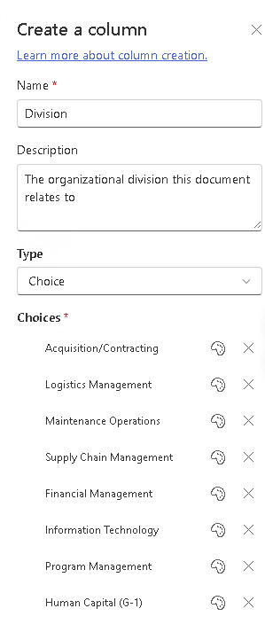

18. Under **More options**, leave **Require that this column contains information** set to **No** (the default)

> [!TIP]
> Optional fields are useful for metadata that's helpful but not always applicable. For example, some documents may apply to all divisions rather than a specific one.

19. Click **Save**

##### Add a Required "Fiscal Year" Choice Column

20. Click **+ Add column** and select **Choice**

21. Configure the column:
    - **Name:** `Fiscal Year`
    - **Description:** `The fiscal year this document covers`
    - **Choices:**
      - `FY2024`
      - `FY2025`
      - `FY2026`
      - `FY2027`

22. Under **More options**, set **Require that this column contains information** to **Yes**

23. Set **Default value** to `FY2026`

    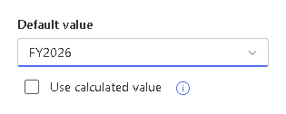

> [!TIP]
> Setting a default value saves time for users when most documents will have the same value. Users can still change it if needed.

24. Click **Save**

##### Add an Optional "Status" Choice Column

25. Click **+ Add column** and select **Choice**

26. Configure the column:
    - **Name:** `Status`
    - **Description:** `Current status of this document or training requirement`
    - **Choices:**
      - `Current`
      - `Under Review`
      - `Superseded`
      - `Draft`
      - `Archived`

27. Leave as optional (not required)

28. Set **Default value** to `Current`

29. Click **Save**

##### Add an Optional "Compliance Rate" Number Column

30. Click **+ Add column**

31. Select **Number** as the column type

    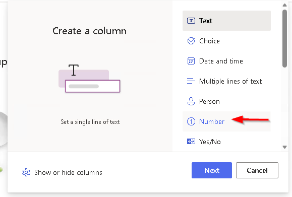

32. Configure the column:
    - **Name:** `Compliance Rate`
    - **Description:** `Overall compliance percentage for training reports (enter as whole number, e.g., 97 for 97%)`

    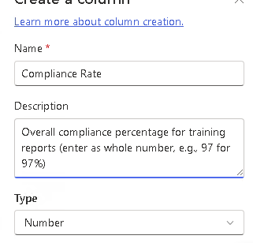

33. Under **More options**:
    - Set **Number of decimal places** to `1`
    - Set **Min value** to `0`
    - Set **Max value** to `100`

    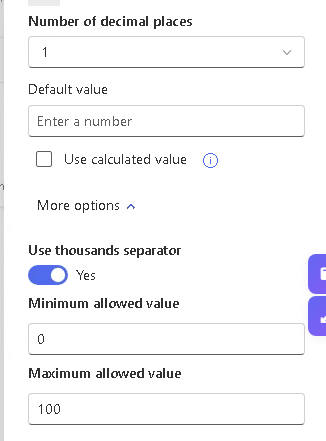

34. Click **Save**

##### Add an Optional "Report Date" Date Column

35. Click **+ Add column**

36. Select **Date and time** as the column type

    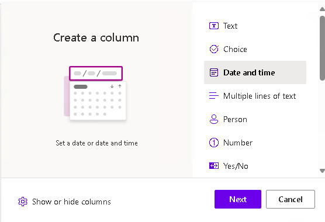

37. Configure the column:
    - **Name:** `Report Date`
    - **Description:** `The date this report or document was prepared`

38. Under **More options**:
    - Set **Include Time** to **No** (date only)

    

39. Click **Save**

#### Review Your Column Configuration

40. Your document library should now show the following columns in the header:
    - Name
    - Document Type (required)
    - Division (optional)
    - Fiscal Year (required, default: FY2026)
    - Status (optional, default: Current)
    - Compliance Rate (optional)
    - Report Date (optional)
    - Modified
    - Modified By

> [!NOTE]
> The columns with **(required)** will show a red asterisk (*) when editing document properties. Users cannot save without completing these fields.

#### Upload a Document with Metadata

41. Click **Upload** in the command bar and select **Files**

    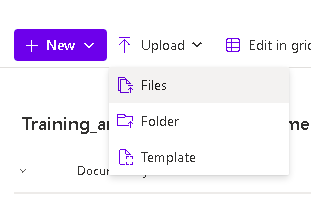

42. Navigate to **Downloads folders** and select the file **05_Training_Certification_Status.md.docx**

    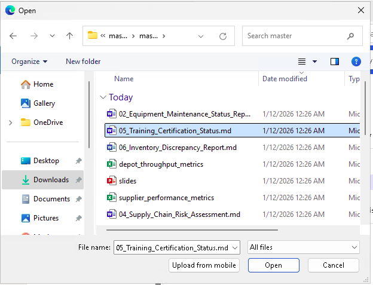

43. Click **Open**

44. After the file uploads, you'll see it in the library. Notice that the required fields are empty and need to be filled in

    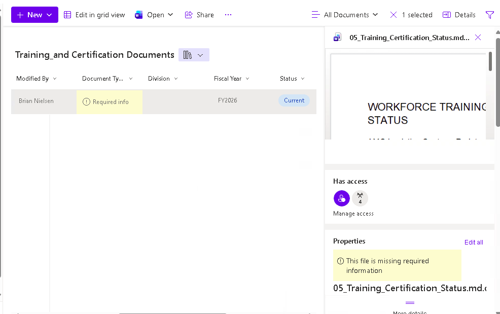

45. Click on the file name to select it, then click the **Details** link (i) in the command bar, on the right, to open the details pane

    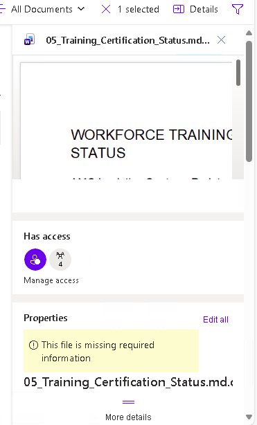

    **OR** Right-click the file and select **Details**

46. In the details pane on the right, fill in the metadata:
    - **Document Type:** `Training Compliance Report` (required)
    - **Division:** `Human Capital (G-1)`
    - **Fiscal Year:** `FY2026` (required - should already be set as default)
    - **Status:** `Current` (should already be set as default)
    - **Compliance Rate:** `97.2`
    - **Report Date:** `01/05/2026`

    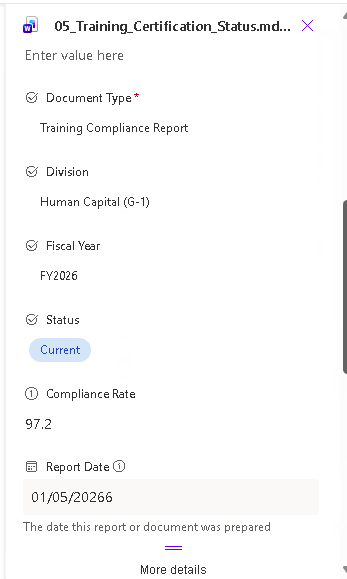

47. The metadata is automatically saved as you enter it. Close the details pane by clicking the **X**

    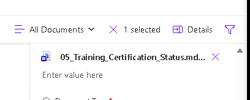

48. Your document now appears in the library with all metadata visible in the columns

    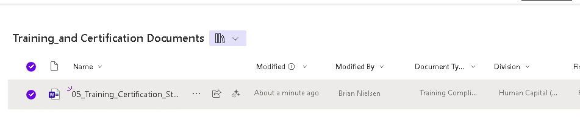

#### Filter Documents Using Metadata

49. To filter the library, click the dropdown arrow on any column header. For example, click the dropdown on **Document Type**

    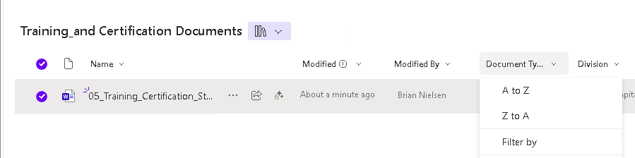

50. Select **Filter by** and check the document types you want to see

    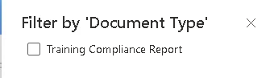

51. Click **Apply** to filter the view

52. Notice the filter icon appears on the column header, indicating a filter is active

    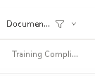

53. To clear filters, click the column dropdown and select **Clear filter**

    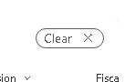

---

### Congratulations! You've created a document library with custom metadata columns, including both required and optional fields, and uploaded your first document with proper tagging.

---

## 📊 Use Case #2: Creating SharePoint Lists from Excel Data

Transform Excel spreadsheet data into a collaborative SharePoint list with filters, views, and sorting capabilities.

| Use Case                                                | Value Added                                                                                                                    | Estimated Effort |
| ------------------------------------------------------- | ------------------------------------------------------------------------------------------------------------------------------ | ---------------- |
| Creating SharePoint Lists from Excel Data | Transform Excel spreadsheets into collaborative, filterable SharePoint lists with custom views | 25 minutes       |

**Summary of tasks**

In this section, you'll import equipment readiness data from Excel into a SharePoint list, create filters to narrow down data, build custom views for different audiences, and apply sorting and grouping.

**Scenario:** Your maintenance operations team tracks equipment operational readiness (OR) rates in an Excel spreadsheet. Leadership wants this data accessible to multiple stakeholders without emailing spreadsheets back and forth. You'll import this data into SharePoint and create views for different needs—one showing all data, one filtered to vehicles below target, and one grouped by performance trends.

### Objective

Import Excel data into a SharePoint list and create custom views with filters, sorting, and grouping for effective data analysis.

---

### Step-by-step instructions

#### Prepare Your Excel File

Before importing, ensure your Excel file is properly formatted.

1. Open the file **equipment_readiness_trends.xlsx** in Excel to review its structure

    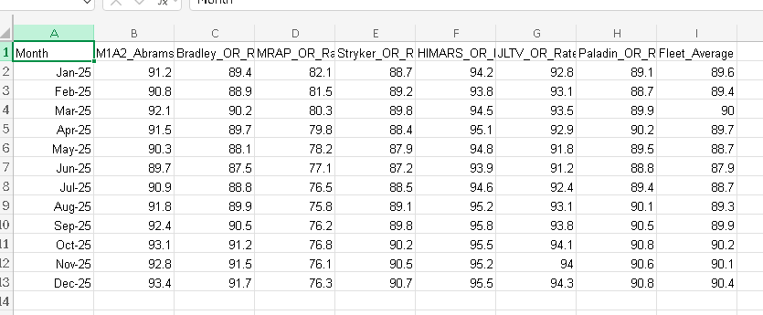

2. Verify the data has:
   - **Headers in Row 1:** Month, M1A2_Abrams_OR_Rate, Bradley_OR_Rate, MRAP_OR_Rate, Stryker_OR_Rate, HIMARS_OR_Rate, JLTV_OR_Rate, Paladin_OR_Rate, Fleet_Average
   - **Data starting in Row 2:** Monthly readiness percentages for each equipment type
   - **No blank rows** between the header and data

> [!IMPORTANT]
> For a successful import, your Excel file must have:
> - Column headers in the first row
> - No merged cells
> - No blank rows within the data
> - Data formatted as a table (recommended but not required)

1. Close the Excel file (SharePoint cannot import a file that's open)

#### Create a SharePoint List from Excel

4. Navigate to your SharePoint site

5. Click **+ New** in the command bar and select **List** from the dropdown

    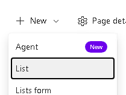

6. In the **Create a list** panel, you'll see several options. Click **Import from Excel**

    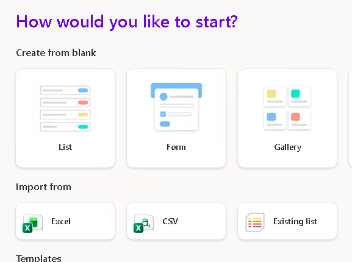

7. Click **Upload file**.  Navigate to **Downloads folders** and select **equipment_readiness_trends.xlsx**

    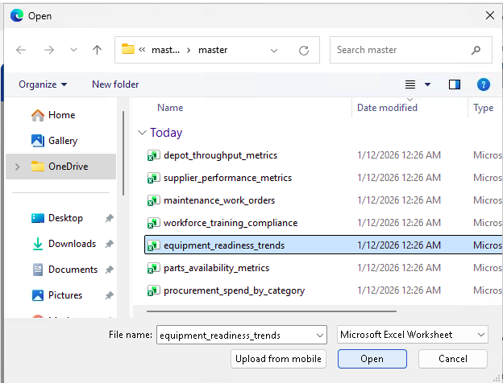

1.  Click **Open**

    > Note: Need to define a table in the Excel file

1. Click the Open button to open the Excel document

    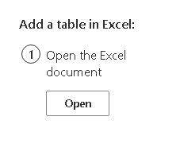

1. Highlight all the cells to be placed in the table

    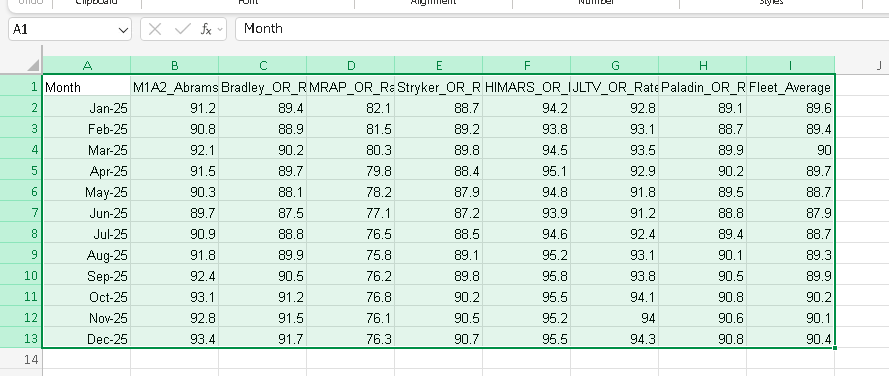

1. Click the **Format as Table** dropdown and select the first option.
   
   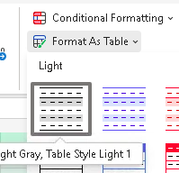

1. Click **Ok** and leave the checkmark checked.

    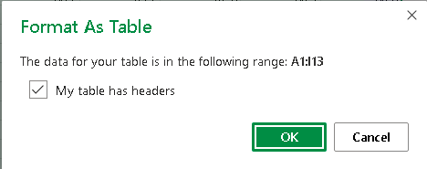

1. After formatting as table

    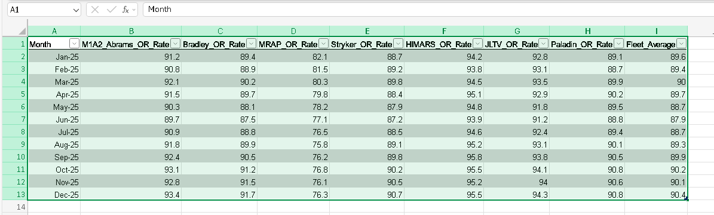

1. Return to the previous tab and click the **Refresh** button

    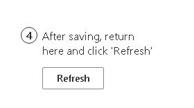

2.  SharePoint will process the file and show you a preview of the data with detected column types

    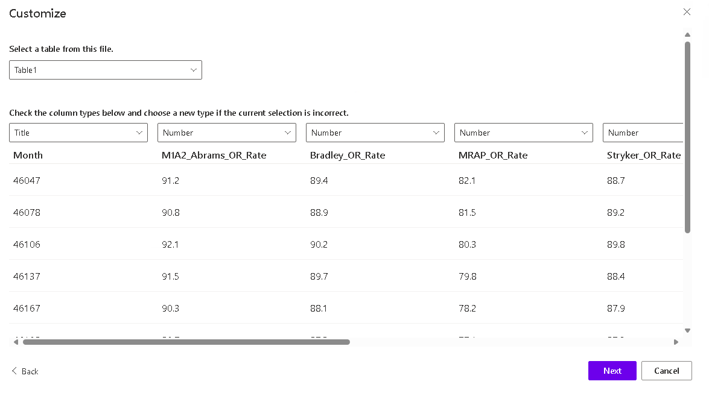

3.  Review each column and verify the detected types are correct:
    - **Month** should be detected as **Date and Time**
    - All **OR_Rate** columns should be detected as **Number**
    - **Fleet_Average** should be detected as **Number**

> [!TIP]
> If SharePoint detected a column type incorrectly, click the column type dropdown to change it. For example, if a number column was detected as text, change it to Number.

1.  If any column types need adjustment, click the dropdown next to the column name and select the correct type

1. Click **Next**  

2.  Update the name of the view:
    - **Name:** `Equipment Readiness Trends`

    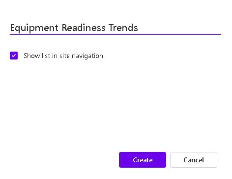

3.  Click **Create**

4.  Your new SharePoint list will open, displaying all the imported data

#### Rename Columns for Readability

The imported column names from Excel may be technical. Let's rename them to be more user-friendly.

17. Click the dropdown arrow on the **M1A2_Abrams_OR_Rate** column header

    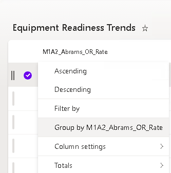

18. Select **Column settings** > **Rename**

    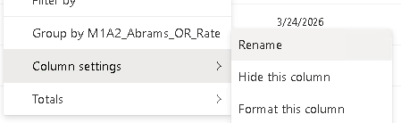

19. Change the name to `M1A2 Abrams (%)` and press **Enter** or click **Save**

    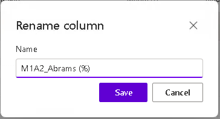

20. Repeat for other columns as desired:
    - `Bradley_OR_Rate` → `Bradley (%)`
    - `MRAP_OR_Rate` → `MRAP (%)`
    - `Stryker_OR_Rate` → `Stryker (%)`
    - `HIMARS_OR_Rate` → `HIMARS (%)`
    - `JLTV_OR_Rate` → `JLTV (%)`
    - `Paladin_OR_Rate` → `Paladin (%)`
    - `Fleet_Average` → `Fleet Average (%)`

  

#### Apply Filters to the List in a new view

21. Click the **Add view** button

    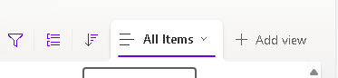

22. Change the View name to **Fleet average less than 90** than click **Create**

    

1. Click the gear in the upper-right hand corner and select **List Settings**

    

1. Scroll down till you see the Views section and click on the **Fleet average less than 90**

    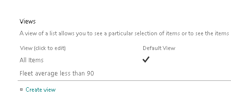

1. Scroll down till you see the **Filter** section

    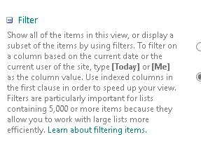

2.  In the filter panel, you can set conditions. Select **Fleet Average (%)** **is less than** and enter `90`

    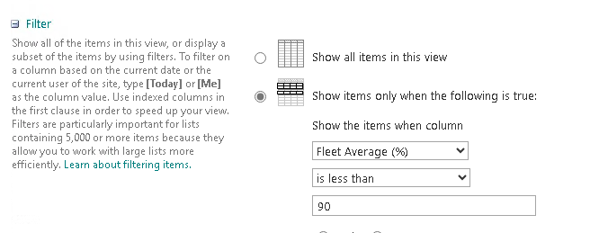

3.  Scroll down and Click **OK**

4.  The list now shows only months where the Fleet Average was below 90%

    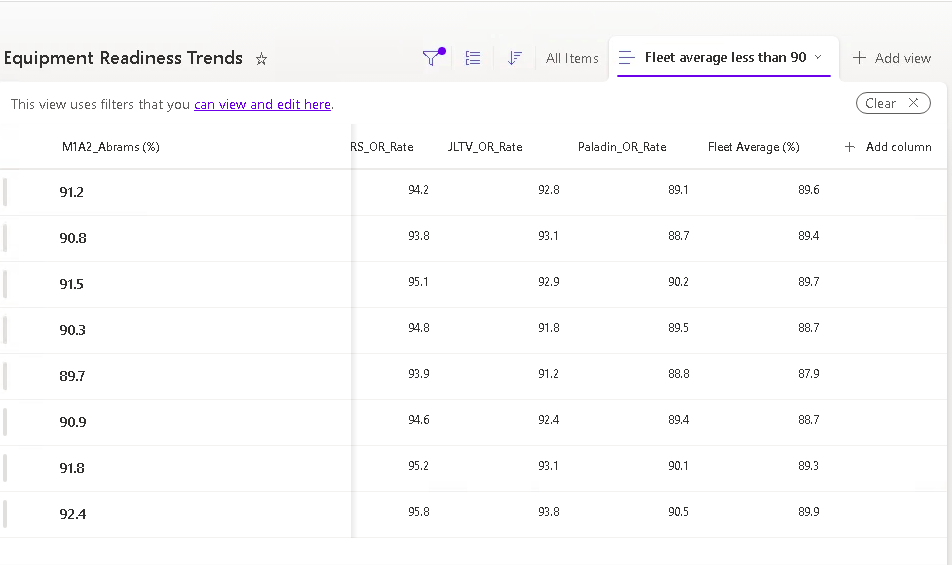

#### Sort the List

28. Click the dropdown arrow on the **Month** column

29. Select **Sort older to newer** to see data in chronological order

    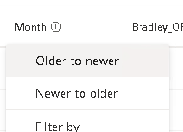

30. The list is now sorted with the oldest month first

    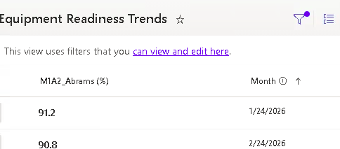

31. To sort by a different column, click that column's dropdown. For example, sort **Fleet Average (%)** from **Smaller to larger** to see the worst-performing months first

#### Create a Custom View

Views allow you to save specific column configurations, filters, and sorting for quick access.

##### Create a "Below Target" View

41. Click **View options** > **Create new view**

42. Configure:
    - **View name:** `Below 90% Target`
    - **Show as:** List

43. Click **Create**

44. Click **View options** > **Edit current view**

45. Scroll down to the **Filter** section

46. Select **Show items only when the following is true:**

47. Set the filter:
    - **Column:** Fleet Average (%)
    - **Operator:** is less than
    - **Value:** 90

48. Click **Save**

49. This view now only shows months where the fleet average fell below the 90% target

##### Create a "MRAP Focus" View

Since MRAP has consistently low readiness rates, create a focused view for maintenance planners.

50. Click **View options** > **Create new view**

51. Configure:
    - **View name:** `MRAP Analysis`
    - **Show as:** List

52. Click **Create**

53. Click **View options** > **Edit current view**

54. Under columns, show only:
    - Month (checked)
    - MRAP (%) (checked)
    - Fleet Average (%) (checked)
    - Uncheck all other equipment columns

55. Under **Sort**:
    - Sort by: MRAP (%)
    - Order: Ascending (smallest to largest)

56. Under **Filter**:
    - Show items where MRAP (%) is less than 80

57. Click **Save**

58. This view shows only months where MRAP readiness was below 80%, sorted from worst to best

#### Switch Between Views

59. Click the **View options** dropdown to see all your saved views

    

60. Click on any view name to switch to that view instantly

    

> [!TIP]
> Views are saved at the list level and available to anyone who has access to the list. You can create personal views (visible only to you) or public views (visible to everyone).

#### Export List Data Back to Excel

66. If you need to perform complex analysis in Excel, you can export the list:
    - Click **Export** in the command bar
    - Select **Export to Excel**

67. An Excel file will download with a live connection to the SharePoint list, allowing you to refresh data as it changes

---

### Congratulations! You've successfully imported Excel data into a SharePoint list, created multiple custom views with filters and sorting, and learned to switch between views for different analytical needs.

---

## 📝 Summary of Learnings

In this lab, you learned how to:

### Document Libraries
- Create a new document library with a descriptive name and purpose
- Add custom metadata columns of different types (Choice, Number, Date)
- Configure **required fields** that enforce data quality
- Set **default values** to save time during data entry
- Upload documents and apply metadata tags
- Filter documents using column values

### SharePoint Lists
- Import Excel spreadsheet data into SharePoint lists
- Verify and correct column data types during import
- Rename columns for better readability
- Apply filters to narrow down list data
- Sort data by any column in ascending or descending order
- Create and save **custom views** with specific:
  - Column selections
  - Sort orders
  - Filter conditions
- Switch between views for different analytical needs
- Export list data back to Excel for advanced analysis

---

## ✅ Conclusions & Recommendations

**Key Takeaways:**

| Feature | Best Practice |
|---------|---------------|
| Required Fields | Use for critical metadata that must always be present (Document Type, Fiscal Year) |
| Optional Fields | Use for helpful but not always applicable information (Division, Compliance Rate) |
| Default Values | Set when most items will share the same value to save time |
| Choice Columns | Use predefined options to ensure consistency and enable filtering |
| Custom Views | Create views for specific audiences or tasks (Leadership, Maintenance Planners, Auditors) |
| Filters | Use to quickly find relevant data without creating a permanent view |

**Next Steps:**

1. **Practice** by creating additional document libraries for different document types (policies, SOPs, contracts)
2. **Explore** SharePoint list formatting options to add color-coding based on values
3. **Learn** Power Automate to create workflows that notify supervisors when compliance rates drop below targets
4. **Consider** connecting your SharePoint lists to Power BI for advanced dashboards and visualizations

**Pro Tips:**

- Always plan your metadata columns before creating a library—changing required fields later can be disruptive
- Use consistent naming conventions across libraries and lists
- Train your team on the importance of filling in metadata correctly
- Create a "Quick Reference" view as the default for everyday use, with specialized views for specific tasks

---

### Congratulations! You've completed the SharePoint Fundamentals lab and now have the skills to organize documents with custom metadata and transform Excel data into collaborative SharePoint lists!

---
