# Build Progressive AI Assistants with Agent Builder in Microsoft 365

Master agent creation from basic web-grounded assistants to advanced SharePoint-integrated agents with code interpreter and image generation capabilities.

---

## 🧭 Lab Details

| Level   | Persona                       | Duration   | Purpose                                                                                                                                                                                                                                                                                              |
| ------- | ----------------------------- | ---------- | ---------------------------------------------------------------------------------------------------------------------------------------------------------------------------------------------------------------------------------------------------------------------------------------------------- |
| 100-200 | Maker (Basic to Intermediate) | 30 minutes | After completing this lab, attendees will be able to create progressively sophisticated Copilot, starting with simple web-based knowledge sources, advancing to SharePoint integration, and mastering advanced AI capabilities like code interpretation, data analysis, and image generation. |

---

## 📚 Table of Contents

- [Why This Matters](#-why-this-matters)
- [Introduction](#-introduction)
- [Core Concepts Overview](#-core-concepts-overview)
- [Documentation and Additional Training Links](#-documentation-and-additional-training-links)
- [Prerequisites](#-prerequisites)
- [Summary of Targets](#-summary-of-targets)
- [Use Cases Covered](#-use-cases-covered)
- [Instructions by Use Case](#️-instructions-by-use-case)
  - [Use Case #1: Create a web-based learning assistant](#-use-case-1-create-a-web-based-learning-assistant)
  - [Use Case #2: Build an grounded data assistant](#-use-case-2-build-an-advanced-sharepoint-integrated-sales-assistant)
- [Summary of Learnings](#-summary-of-learnings)
- [Conclusions & Recommendations](#conclusions--recommendations)

---

## 🤔 Why This Matters

**For makers and citizen developers:** You don't need to be a programmer to create powerful AI assistants that can transform how your team works.

Think of building agents like teaching a new team member:

- **Without structured training**: They fumble through tasks, give inconsistent answers, and waste everyone's time
- **With progressive skill development**: They become increasingly valuable, handling simple queries at first, then complex analysis and creative tasks

**Common challenges solved by this lab:**

- "Our team keeps asking the same questions about our products and policies"
- "We need to analyze sales data quickly, but most people don't know Excel formulas"
- "We want AI assistance grounded in our actual business documents, not generic responses"
- "We need professional visuals for presentations but don't have design resources"

**This 30-minute investment will teach you skills you'll use repeatedly** to create agents for any department or use case.

---

## 🌐 Introduction

You'll start by testing Microsoft 365 Copilot's basic capabilities, then build a web-based learning assistant grounded in Microsoft documentation. Finally, you'll create an advanced prompt that integrates SharePoint data, performs analysis, and generates professional visuals.

**Real-world example:** An Army Materiel Command logistics team at Redstone Arsenal struggled with repetitive questions about contractor performance, equipment readiness, and training compliance. After completing this lab, they created agents that extract key data from CPARs, analyze maintenance trends from spreadsheets, and flag supply chain risks. What used to require manually reading through lengthy reports now happens in seconds with questions like "What are the risk areas for this contractor?" or "Which divisions are below compliance targets?"

---


---

## 📄 Documentation and Additional Training Links

- [Overview of Microsoft 365 Copilot Chat](https://learn.microsoft.com/en-us/copilot/chat)
- [What is Microsoft 365 Copilot?](https://learn.microsoft.com/en-us/microsoft-365-copilot)
- [Declarative Agents for Microsoft 365 Copilot](https://learn.microsoft.com/en-us/microsoft-365-copilot/extensibility/overview-declarative-agent)
- [Use Agent Builder in Microsoft 365 to Build Agents](https://learn.microsoft.com/en-us/microsoft-365-copilot/extensibility/agent-builder-build-agents)
- [Microsoft Copilot Studio Documentation](https://learn.microsoft.com/en-us/microsoft-copilot-studio/)

---

## ✅ Prerequisites

- Access to Microsoft 365 Copilot or Copilot Chat
- Ability to create and configure Copilot agents
- Access to a SharePoint site with sample sales data (for Use Case #2)
- Basic understanding of Excel data structures (for Use Case #2)

---

## 🎯 Summary of Targets

In this lab, you'll progress from basic agent creation to advanced AI capabilities. By the end of the lab, you will:

- **Understand** the differences between Microsoft 365 Copilot and Copilot Chat and when to use each
- **Create** a web-based learning assistant grounded in official Microsoft documentation
- **Configure** agent behavior, tone, and knowledge sources for specific use cases
- **Build** an advanced SharePoint-integrated agent with code interpreter and image generation
- **Analyze** sales data and generate professional charts through natural language requests
- **Apply** best practices for agent design, grounding strategies, and knowledge source selection

---

## 🧩 Use Cases Covered

| Step | Use Case                                                                                                                        | Value added                                                                                                                    | Effort |
| ---- | ------------------------------------------------------------------------------------------------------------------------------- | ------------------------------------------------------------------------------------------------------------------------------ | ------ |
| 1    | [Create a web-based learning assistant](#-use-case-1-create-a-web-based-learning-assistant)                                     | Build foundational skills by creating an instructional agent grounded in trusted documentation                                 | 15 min |
| 2    | [Build an grounded data assistant](#-use-case-2-build-an-advanced-sharepoint-integrated-sales-assistant) | Master advanced features including SharePoint integration, code interpretation, and image generation for business intelligence | 15 min |

---

## 🛠️ Instructions by Use Case

---

## 🤖 Use Case #1: Create a web-based learning assistant

Build your first Copilot agent that helps users learn about Microsoft Copilot capabilities, grounded in official documentation.

| Use case                              | Value added                                                                                    | Estimated effort |
| ------------------------------------- | ---------------------------------------------------------------------------------------------- | ---------------- |
| Create a web-based learning assistant | Build foundational skills by creating an instructional agent grounded in trusted documentation | 15 minutes       |

**Summary of tasks**

In this section, you'll test basic Copilot functionality, then create a teacher-style agent that explains Copilot concepts using grounded knowledge sources. You'll learn to configure agent behavior, tone, and knowledge sources.

**Scenario:** Your organization is rolling out Microsoft Copilot and needs a learning resource. Build a teacher-style agent that can answer questions about Copilot capabilities, clarify key distinctions (like Microsoft 365 Copilot vs. Copilot Chat, or Declarative vs. Custom Engine agents), and guide users with accurate, contextual responses grounded in Microsoft documentation.

### Objective

Create, configure, and test a web-based Copilot agent that serves as a knowledgeable guide for learning about Microsoft Copilot.

---

### Step-by-step instructions

#### Navigate to Microsoft 365 Copilot

1. Navigate to [Microsoft 365 Copilot home page](https://m365.cloud.microsoft/chat/?auth=2&home=1)


2. Go to the **Chat** tab.

> [!TIP]  
> Both Microsoft 365 Copilot and Copilot Chat are designed for internal, employee-facing (B2E) experiences.
>
> - Users who have **only Copilot Chat** will **not see any toggle** in the interface – this is expected.
> - Users who have **both** Microsoft 365 Copilot and Copilot Chat will see a **toggle** that lets them switch between the **Work** (Microsoft 365 Copilot) and **Web** (Copilot Chat) experiences.
>
> 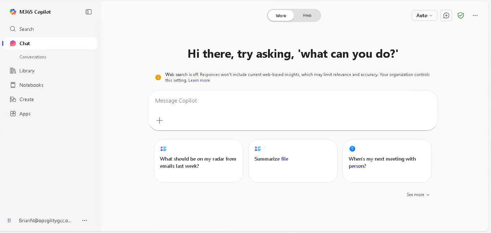
>
> **Microsoft 365 Copilot** is a per-user license ($30/user/mo.) with premium features:
>
> - Advanced agents like the research and analysts Frontier ones, grounded on enterprise data and using the latest reasoning models
> - Knowledge sources (e.g., your enterprise data from Outlook, Teams, SharePoint, or Copilot connectors)
>
> **Copilot Chat** is the enterprise version of ChatGPT included with many Microsoft 365 licenses at no extra cost. It uses the same underlying models and can access web data to generate answers.
>
> - Copilot Chat can leverage premium capabilities like organization-tenant grounding for answers when tied to a pay-as-you-go Azure subscription.
>
> Two types of agents can appear in Microsoft 365 Copilot or Copilot Chat:
>
> - **Declarative agents**: These rely on Copilot’s built-in orchestration, search, and reasoning. They define their behavior through instructions, pre-defined prompts, knowledge sources, and actions. Ideal for scoped knowledge retrieval or task-specific use cases.
> - **Custom engine agents**: These do **not** use Copilot as their core engine. They include their own orchestration, knowledge, and skills, and may run on a different platform than Microsoft Copilot. Ideal for advanced or complex scenarios.

#### Test the basic Copilot experience

3. If you have Microsoft 365 Copilot license, make sure you are in the **Web** tab (if you don't see any tab for Work/Web, this means you only have access to Copilot Chat).

    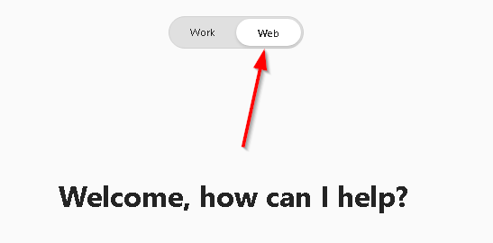

4. Test the basic experience by typing:

```
What are new features in the Microsoft Copilot Studio roadmap?
```


5. Select **Start a new chat** (top right icon) to reset. Notice how your history of converations is saved on the left-hand side.


---

## 📊 Use Case #1: Build a grounded data assistant

Take your skills to the next level by creating an agent that integrates data and uses advanced AI capabilities like code interpretation and image generation.

| Use case                                                | Value added                                                                                                                    | Estimated effort |
| ------------------------------------------------------- | ------------------------------------------------------------------------------------------------------------------------------ | ---------------- |
| Build a grounded data assistant | Master advanced features including data integration, code interpretation, and image generation for business intelligence | 20 minutes       |

**Summary of tasks**

In this section, you'll prepare data sources, create a Admin Assistant with advanced capabilities, and test code interpretation for data analysis and image generation for visual content.

**Scenario:** Your sales operations team needs an intelligent assistant that can analyze sales data from Excel files, answer questions about sales policies, generate dynamic charts and visualizations, and create professional visual content for presentations—all through natural language requests.

### Objective

Build a sophisticated Admin Assistant that integrates organizational data and advanced AI capabilities to transform sales operations.

---

### Step-by-step instructions

#### Navigate to SharePoint

1. Make sure the **Navigation pane** is open and click on **Apps**

    
    
1. Select **SharePoint**
    
    
    
1. Select **Create Site**


1. Select **Team Site**


1. Select **Standard team**


1. Select **Use Template**


1. Put `MBR - <Your User Name>` in the Site Name and Select **Next**


7. Click **Finish**


1. Navigate to your SharePoint site
   - Click on the **Documents** tab in the left-hand navigation to upload all the documents in the **C:\LabFiles**
   - Click the **Upload** button and select **Files** and navigate to **C:\LabFiles**
   
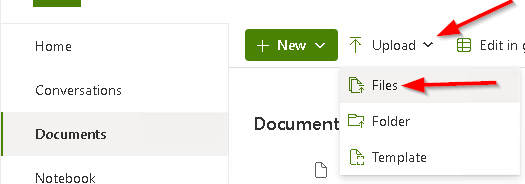

1. Select all the files and click the **Open** button in the popup.
   
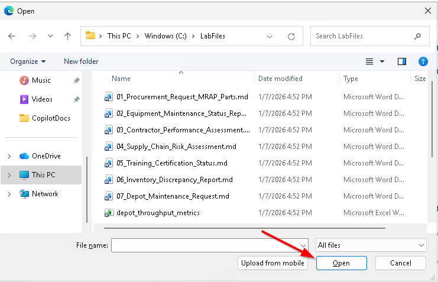

1. The **workforce_training_compliance.xlsx** has the following data structure:

   - It contains data across Division,Total_Personnel, Cyber_Awareness_Complete, OPSEC_Complete, SHARP_Complete, CUI_Complete, Ethics_Complete, DAWIA_Certified,IDP_Current, Avg_Training_Hours_Q1.

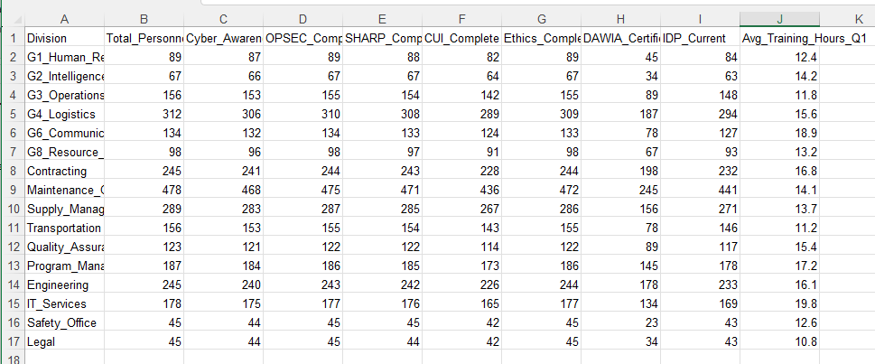

1. The **03_Contractor_Performance_Assessment.md.docx** covers the following information:
   - This is a Contractor Performance Assessment Report (CPAR) for Southeastern Defense Systems, LLC evaluating their work on a $24.75M contract for ground vehicle electronic systems integration and repair at Redstone Arsenal.

#### Create the Admin Assistant agent

1. Return to [Microsoft 365 Copilot Chat](https://m365.cloud.microsoft/chat/?auth=2&home=1) and go to the **Chat** tab. 

1. Ensure that the tab across the top is set to **Work**

    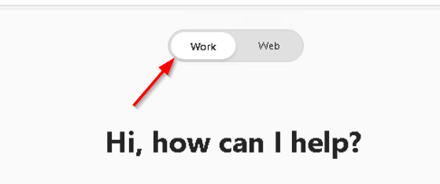

1. In the upper-right hand corner click on the  (Plus sign) to create a new chat.

1. In the search box, use this specific prompt:

    ```
    You are a Training Compliance Analyst. Your job is to help AMC managers track mandatory training completion and identify compliance gaps across divisions. You understand Division, Total Personnel, Cyber Awareness, OPSEC, SHARP, CUI, Ethics, DAWIA Certification, IDP Status, and Average Training Hours. Users can ask questions like "Graph the compliance rates by division" or "Which divisions are below 95% on CUI training?" or "Show me DAWIA certification rates compared to total personnel." You always respond in a friendly and professional tone, aiming to be helpful and flag any compliance risks.
    ```

1. Click on the **+** (Plus sign) in the search box. In the dropdown select **Attach cloud files**

    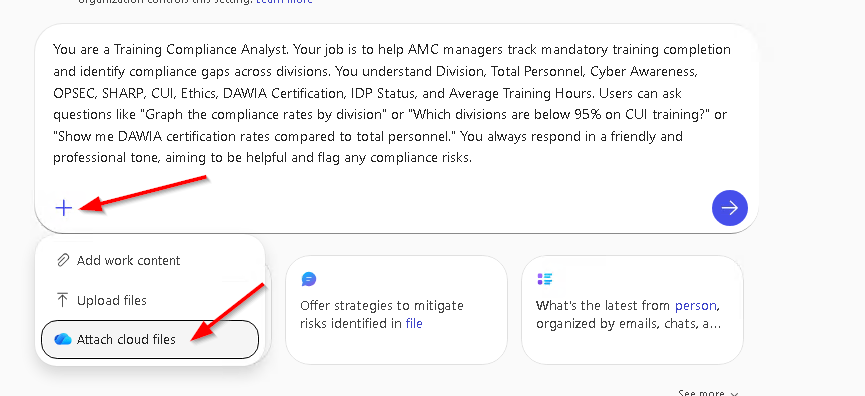
    
1. In the dialog selection **More places** in the bottom left-hand corner.

    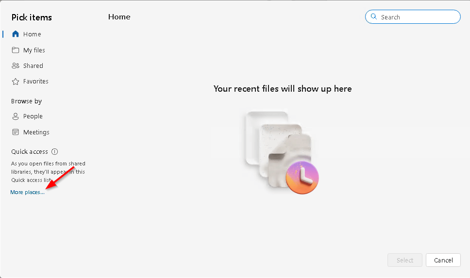
    
1. In the dialog, above the search, scroll down and select your SharePoint site. 

    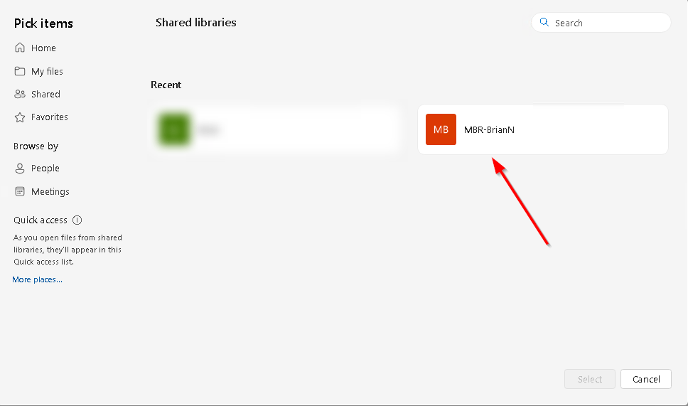
    
1. Select the *workforce_training_compliance.xlsx* document and click the **Select** button

    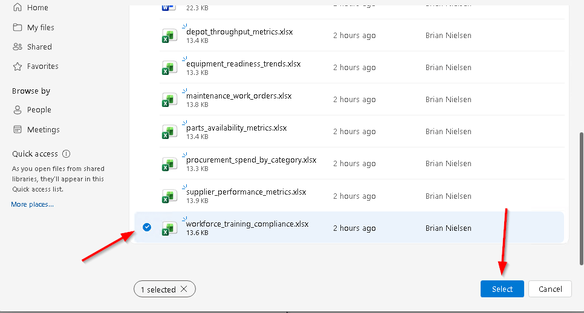
    
1. Click the **Send** button 

1. Initially, you will get a long textual response breaking apart all the data that can be reported on.

    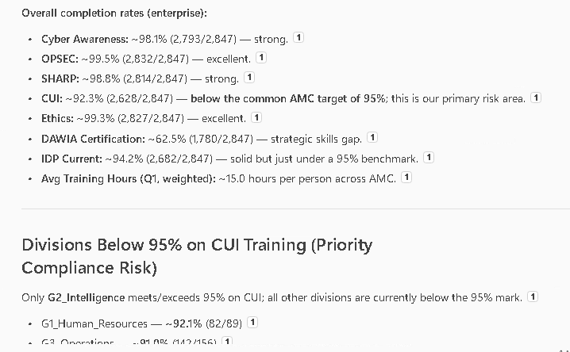
    
1. Towards the end of the text response you will get some hints on how to generate images. 

    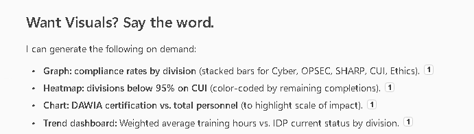
    
1. Go ahead and respond with
    ```
    Graph: compliance rates by division (stacked bars for Cyber, OPSEC, SHARP, CUI, Ethics)
    ```

    > Note: GCC does not allow images to be displayed inline so it takes a little push in your prompt to get a download link 

    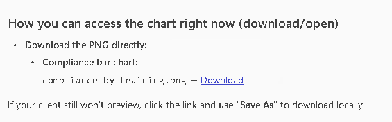

1. The first response will have missing images

    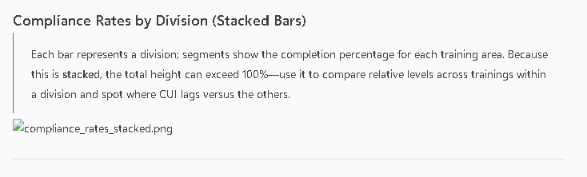
    
1. Add the following prompt to fix the issue
    ```
    In GCC I cannot view images. Let me download
    ```

1. Sample image after correction.

    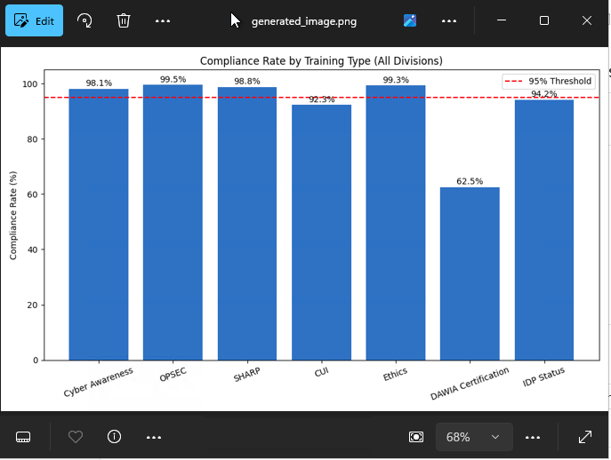
    
1. It will take some time for the link to display. You will see this processing circle.

    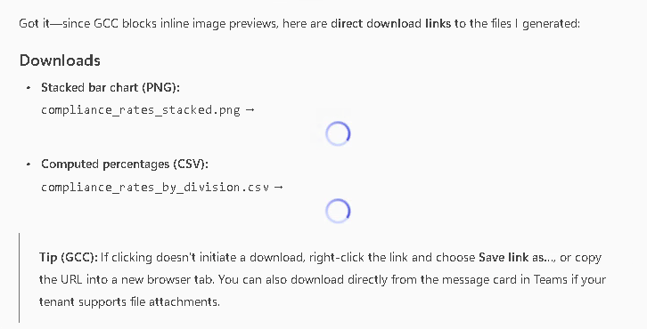
    
#### Repeat the process for a Word Document
1. In the upper-right hand corner click on the  (Plus sign) to create a new chat.

1. In the search box, use this specific prompt:

    ```
    You are a Contract Performance Analyst. You help extract key information from CPARs including contract details, performance ratings, risk areas, corrective actions, and deadlines. Users can ask "What are the risk areas?" or "Summarize the ratings" or "What conditions were placed on continuation?" You respond concisely and flag compliance concerns.
    ```
1. Select the *03_Contractor_Performance_Assessment.md.docx* document from SharePoint using the previous steps. 

1. Review the results after clicking **Send**

    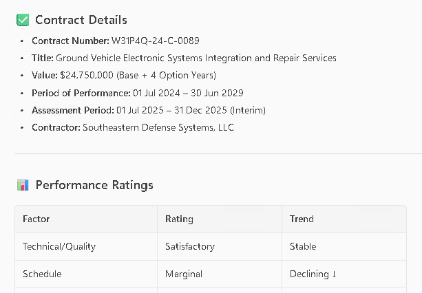
    
1. Append another prompt with any/all of the following prompts

    ```
    Summarize the strengths and weaknesses
    ```
    ```
    Highlight compliance concerns
    ```
    ```
    Prepare a quick risk dashboard for this contract
    ```
    ```
    Create a one-page executive summary PDF for leadership
    ```
1. Here is another sample result after requesting a dashboard
    ```
    visualize this dashboard as a color-coded chart
    ```
    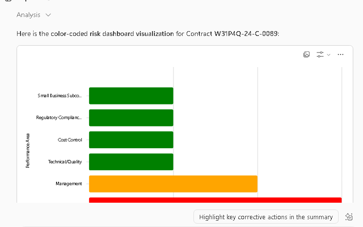

#### Become an expert on the other files
1. With the remaining Word Documents and Excel files create prompts to extract useful information from them.

1. Share your prompts and results with the class. 


---

### Congratulations! You've created customized prompts, worked with custom documents, and learned how to deal with and extract information faster and more repeatable than ever before!!

---

